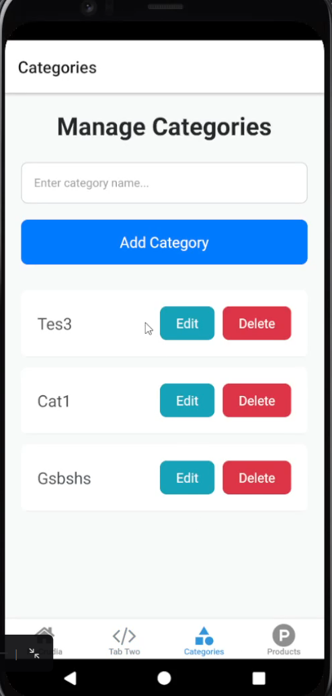
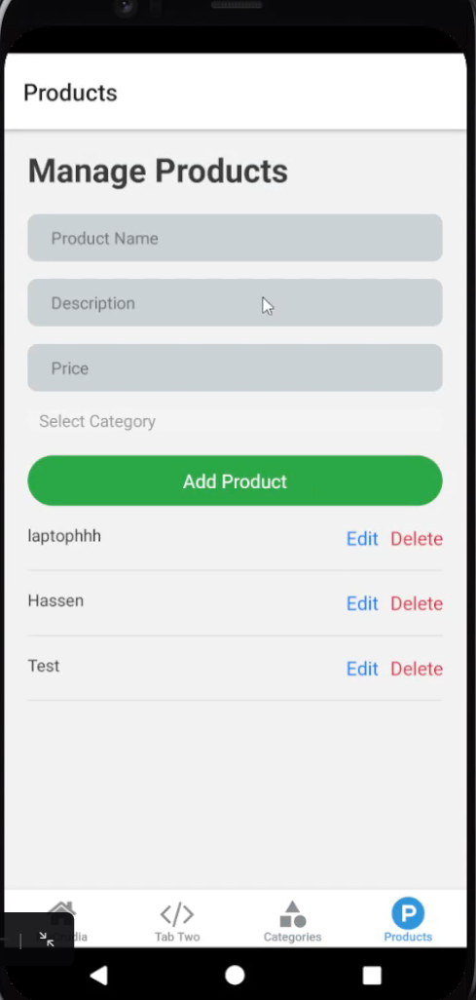
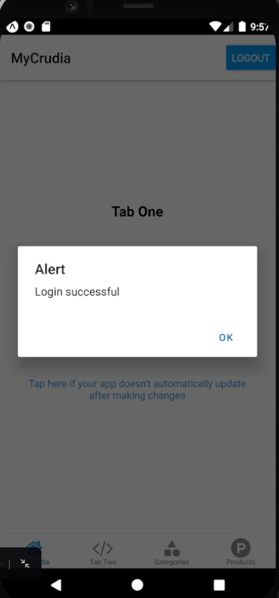
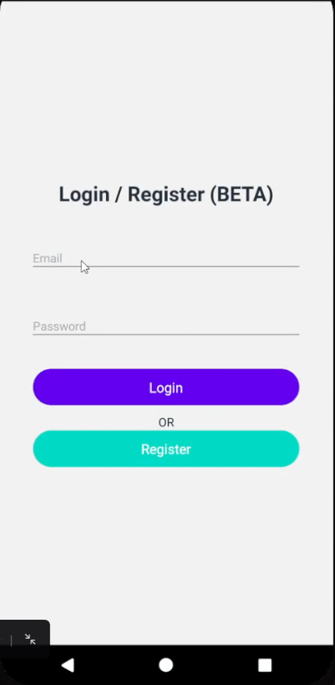
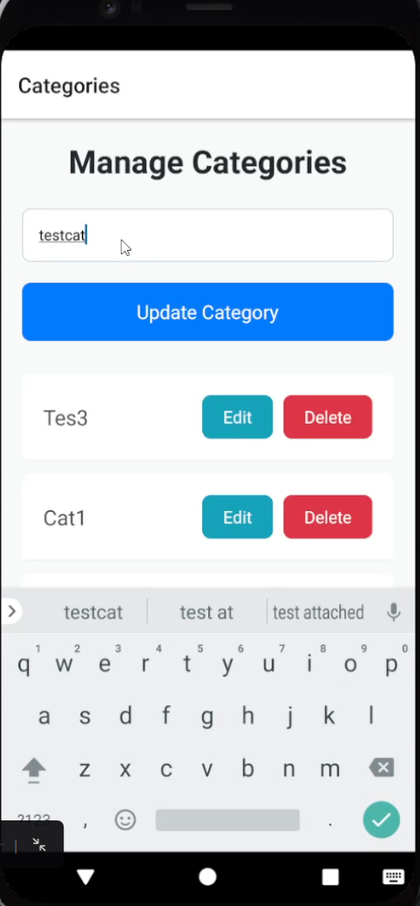
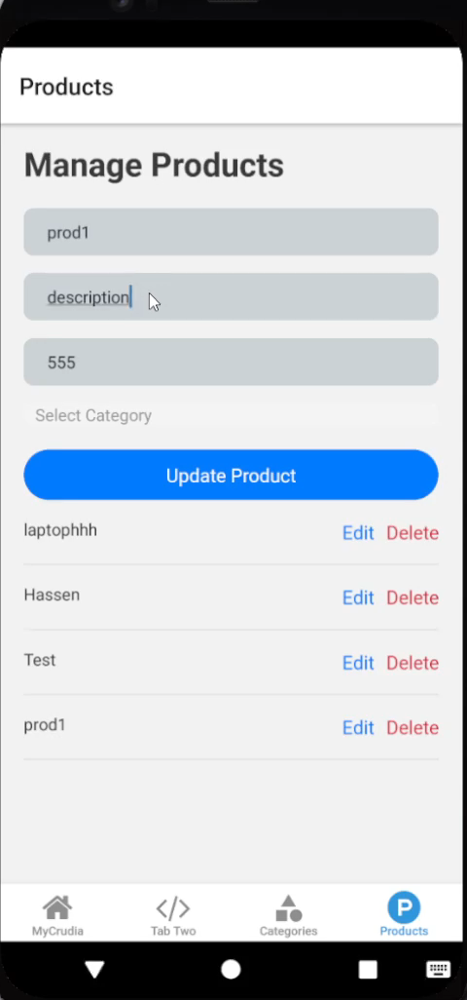

# MyCrudia Project

Welcome to the MyCrudia project! This repository contains the complete source code for the **MyCrudia** mobile application, its backend server, and showcases of its features.

Welcome to the MyCrudia project! This repository contains the complete source code for the **MyCrudia** mobile application, its backend server, and showcases of its features.

---

## Project Overview

**MyCrudia** is a mobile application built using **React Native** and backed by a custom **Node.js server**. The app offers a seamless interface for managing categories and products while providing a robust backend to handle data and authentication. The project is structured as follows:

- **/mycrudia**: Contains the mobile application code.
- **/server**: Contains the backend code.
- **/showcase**: Contains screenshots and videos of the app in action.

---

## Open Source Contribution

**MyCrudia** is an open-source project, and we welcome contributions from the community! Whether you're fixing bugs, adding new features, or improving documentation, we encourage you to get involved and help make MyCrudia even better. Feel free to fork the repository, create pull requests, and share your ideas.

---
## Frontend and Backend Guides

### **Frontend**
For detailed instructions on setting up and understanding the frontend, refer to the [README.md](https://github.com/xloyb/MyCrudia/tree/main/MyCrudia#readme) inside the **/mycrudia** directory.

### **Backend**
For detailed instructions on setting up and understanding the backend, refer to the [README.md](https://github.com/xloyb/MyCrudia/blob/main/server/Readme.md) inside the **/server** directory.

---

## App Showcase

### Screenshots

#### Add Category

#### Add Product

#### Alert

#### Login Screen

#### Update Category

#### Update Product

### Video Demo
You can stream the demo video directly on Vimeo:  

Alternatively, download the video directly: [Watch Demo](showcase/vid.mp4)

---

